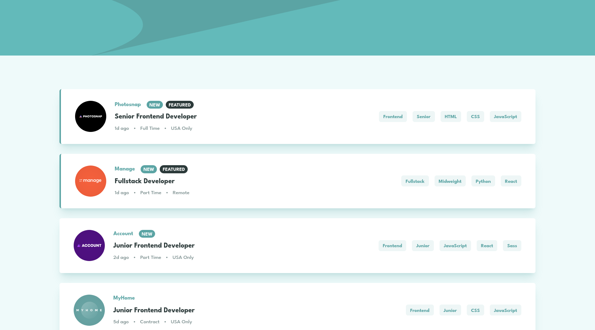
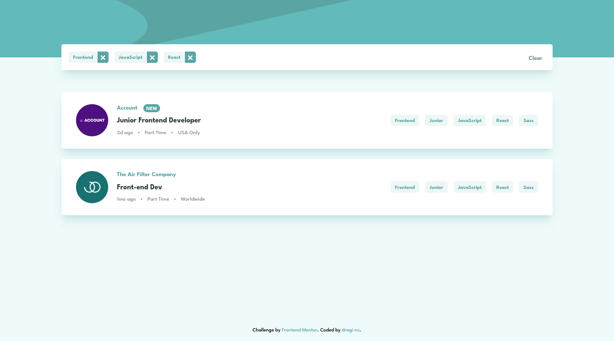
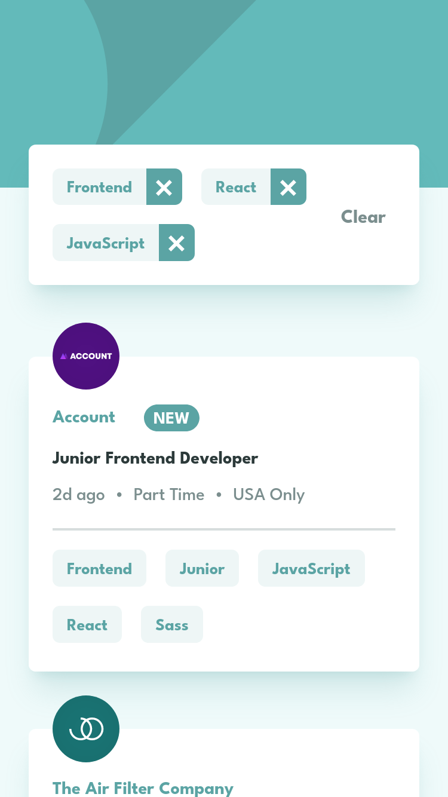

# Frontend Mentor - Job listings with filtering solution

This is a solution to the [Job listings with filtering challenge on Frontend Mentor](https://www.frontendmentor.io/challenges/job-listings-with-filtering-ivstIPCt). Frontend Mentor challenges help you improve your coding skills by building realistic projects.

## Table of contents

- [Overview](#overview)
  - [The challenge](#the-challenge)
  - [Screenshot](#screenshot)
  - [Links](#links)
- [My process](#my-process)
  - [Built with](#built-with)
- [Author](#author)

## Overview

### The challenge

Users should be able to:

- View the optimal layout for the site depending on their device's screen size
- See hover states for all interactive elements on the page
- Filter job listings based on the categories

### Screenshot

### Links

- Solution URL: https://github.com/dragi-ns/static-job-listings
- Live Site URL: https://dragi-ns.github.io/static-job-listings

## My process

### Built with

- Semantic HTML5 markup
- Flexbox
- Mobile-first workflow
- [React](https://reactjs.org/)
- [Tailwind](https://tailwindcss.com)
- [Framer Motion](https://www.framer.com/motion/)
- [TypeScript](https://www.typescriptlang.org/)
- [Vite](https://vitejs.dev/)

## Author

- Website - [dragi-ns](https://github.com/dragi-ns)
